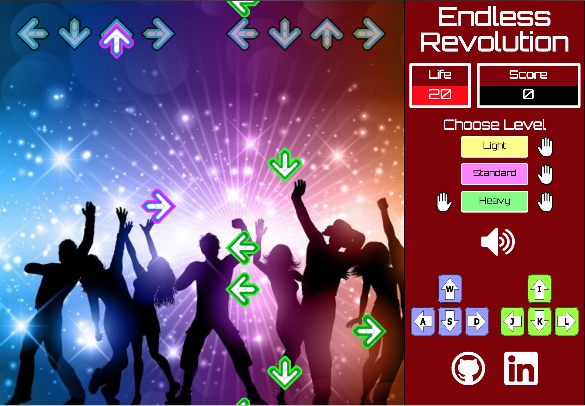

## Endless Revolution

### Background

[Endless Revolution][live] is an implementation of the popular 4-arrow rhythm game Dance Dance Revolution where players must press corresponding arrow keys as they scroll past the top line of arrows. The twist is that the gameplay doesn't end until the user misses too many consecutive arrows and causes life points to reach 0.

Endless Revolution is a personal project by Gary Yeh.

[live]: https://garyeh.github.io/EndlessRevolution/endless.html


### Instructions

* Choose a level (Light, Standard, Heavy) to begin/restart

  (Only in "Heavy" mode are you required to play with both hands)

* Press the corresponding arrow key right when an arrow crosses the top row of gray arrows

* You start with 100 life. Missed keypresses deduct your life points while successful presses increase them, up to 200.

* If your life hits 0, the game ends!

### Technologies

Endless Revolution was built on JavaScript and rendered on EaselJS. Arrows are perpetually added as children to the bottom Easel stage and removed at the top. Internal tick events inside each arrow simulate the scrolling effect.

One core feature of the game is the gradual acceleration of arrow speed and generation rate. Below you can see that the random generator is being called more frequently over time as speed increases.

```js
setInterval(() => {speed *= 1.0007;} , 100 );
this.myInt = setInterval( randomGen, 7000 / 3 / speed );
```

Inside the arrow ticking function you can see that the increasing speed also affects how fast the arrow travels across the canvas.

```js
function Tick(event) {
  Arrow.y = Arrow.y - speed;
  if (that.Arrows[0] && that.Arrows[0].y < -40) {
    that.miss();
    that.stage.removeChild(that.Arrows[0]);
    that.Arrows.shift();
    tick.off("tick", listener);
  }
  that.stage.update(event);
}
```

Another feature involves two tiers of successful hits which means that you are rewarded more for hitting an arrow within a smaller window. Below is the logic involved which checks first for the top tier ("excellent"), then second ("great"), then finally a "miss" if the arrow is too far away.

```js
if (arrows[0] && arrows[0].y < 40 && arrows[0].y > 10) {
  if (this.life > 0) {
    this.hit("excellent");
  }
  createjs.Ticker.off("tick", arrows[0].listener);
  this.stage.removeChild(arrows[0]);
  arrows.shift();
} else if (arrows[0] && arrows[0].y < 55 && arrows[0].y > -5) {
  if (this.life > 0) {
    this.hit("great");
  }
  createjs.Ticker.off("tick", arrows[0].listener);
  this.stage.removeChild(arrows[0]);
  arrows.shift();
} else {
  this.miss();
}
```

### Future Features

- [ ] Multiplayer and versus AI modes
- [ ] Smoother transitions in arrow generation over time
- [ ] Input options for a dance pad
- [ ] Music accelerates along with the arrow scrolling
