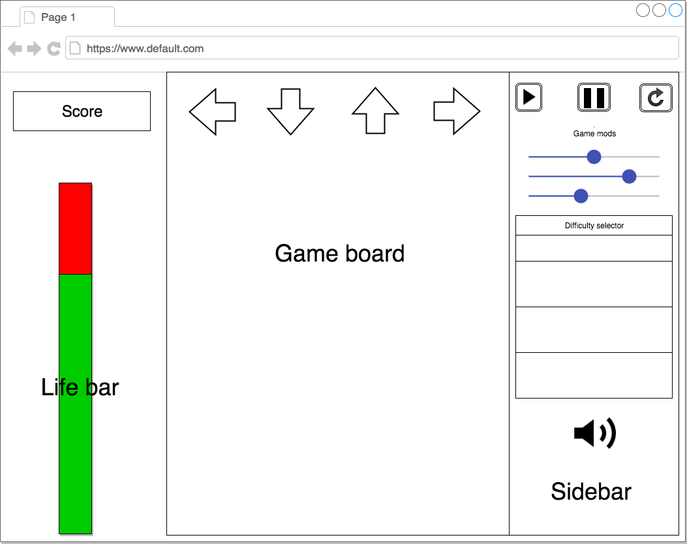

## Endless Revolution

### Background

Endless Revolution is an implementation of the popular 4-arrow rhythm game Dance Dance Revolution where players must press corresponding arrow keys as they scroll past a static outline of their respective shapes. The twist is that the gameplay doesn't end until the user misses too many consecutive arrows and causes life points to reach 0.

### Functionality & MVP

In the game, players will be able to:
- [ ] Press the arrow keys which correspond to the four gameplay controls (up, down, left, right)

Sidebar options:
- [ ] Choose a starting difficulty with different arrow speeds.
- [ ] Reset the game.
- [ ] Mute music

This project will also include:
- [ ] An About modal describing the background and rules of the game
- [ ] Github / LinkedIn links

### Wireframes

This will be a single-page app with a gameplay screen and two sidebars.

The main gameplay screen will have the outline of arrows at the top with a board of incoming arrows that scrolls continuously upwards.

On the right is a sidebar that will have buttons at the top to start, pause, and reset the game depending on the current context. Below will be a selection of starting difficulties to choose from and an audio mute button.

On the left is a score that increments upon successful presses and a life bar.

### Architecture and Technologies

This project will use the following technologies:
* Vanilla JavaScript and jQuery for game logic
* HTML5 Canvas and `easel.js` for DOM manipulation and rendering

The following scripts will be specific to the game itself:
`board.js`: This will handle the random creation of arrows with `easel.js`, store them in an array, and render them to the DOM. It will make calls to the audio element for music playback based on game state (pause/play/mute). It will also keep an instance of the life status and score.
`arrow.js`: This will have a direction assignment + sprite.
`logic.js`: This will handle the scoring logic based on the timing of the arrows. It will be responsible for adding points to the overall score when an arrow gets destroyed.

### Implementation Timeline

**Day 1**: Setup node modules, run webpack, and install `easel.js`.  Create `webpack.config.js` and `package.json`.  Write a basic entry file and the skeleton of all 4 scripts outlined above. Get an audio file from running on the site and an arrow from `easel.js` on the site.

Goals:
- [ ] Get a green bundle with webpack
- [ ] Be able to playback audio
- [ ] Learn `easel.js` and be able to render an arrow

**Day 2**: Continue learning `easel.js`. Create the arrow object to be constructed by the board and be able to render them. Render the structure of the entire screen (main board and sidebars).  Implement random arrow generation/destruction and movement.

Goals:
- [ ] Render the entire skeleton with 3 sections (board and 2 sidebars)
- [ ] Fill the board with arrows moving upwards, randomly created at the bottom and destroyed at the top.

**Day 3**: Add acceleration for board scrolling. Set win/lose conditions for the lifebar. Implement the game input controls.

Goals:
- [ ] Implement board acceleration functionality.
- [ ] Add user input controls (up, down, left, right) and game buttons (restart)
- [ ] Create the scoring line at the top of the board, destroy arrows that are within the scoring interval and count them as 'hits'.
- [ ] Implement lifebar total which goes up / down from hits / misses respectively. Set game over message to an empty lifebar.

**Day 4**: Create the scoring logic for the arrows. Implement and test different starting levels. Finish styling the game screen.

Goals:
- [ ] Add tiers of points based on distance from scoring line if arrow is 'hit'.
- [ ] Have arrow generation rate increase at time intervals
- [ ] Add selection option in sidebar to skip levels
- [ ] Have a styled canvas, nice-looking controls and title

### Bonus features

Some extra features I can include are:
- [ ] Multiplayer and versus AI modes
- [ ] Input options for a dance pad
